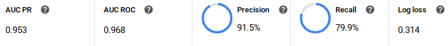
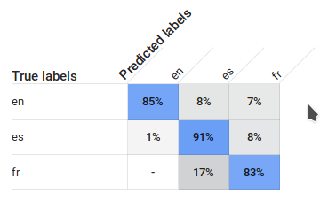

# Test AutoML

This project generates a dataset containing some literal text from Wikipedia
for languages EN, ES and FR. The goal is to predict the language of a text
using AutoML prediction.

After one hour training (the minimum time for AutoML Tables), it performs kinda okay.

